# Load testing your workload running on Amazon EKS with Locust

This repository contains example code for creating EKS clusters and installing necessary addons such as [Cluster Autoscaler](https://github.com/kubernetes/autoscaler/tree/master/cluster-autoscaler) and [AWS Load Balancer Controller](https://github.com/aws/eks-charts/tree/master/stable/aws-load-balancer-controller) and [Locust](https://github.com/deliveryhero/helm-charts/tree/master/stable/locust).

In addition, it provides sample application to be used for testing. Please feel free to replace it with your own application.

For full details about using Locust, please see the [Locust official documentation](http://docs.locust.io/en/stable/).

## Table of content

- [Load testing your workload running on Amazon EKS with Locust](#load-testing-your-workload-running-on-amazon-eks-with-locust)
  - [Table of content](#table-of-content)
  - [Introduction](#introduction)
  - [Overview of solution](#overview-of-solution)
  - [Groundwork](#groundwork)
    - [Prerequisites](#prerequisites)
    - [Provisioning EKS clusters](#provisioning-eks-clusters)
    - [Installing basic addon charts](#installing-basic-addon-charts)
    - [Installing a Sample Application Helm Chart](#installing-a-sample-application-helm-chart)
  - [Walkthrough](#walkthrough)
    - [STEP 1. Install Locust](#step-1-install-locust)
      - [_Switch kubernetes context to run commands on the locust cluster:_](#switch-kubernetes-context-to-run-commands-on-the-locust-cluster)
      - [_Add Delivery Hero public chart repo:_](#add-delivery-hero-public-chart-repo)
      - [_Write a `locustfile.py` file:_](#write-a-locustfilepy-file)
      - [Install and configure Locust with locustfile.py](#install-and-configure-locust-with-locustfilepy)
    - [STEP 2. Expose Locust via ALB](#step-2-expose-locust-via-alb)
    - [STEP 3. Check out the Locust dashboard](#step-3-check-out-the-locust-dashboard)
    - [STEP 4. Run Test](#step-4-run-test)
    - [STEP 5. Run Test (2nd)](#step-5-run-test-2nd)
  - [Cleaning up](#cleaning-up)
  - [Summary](#summary)
  - [Security](#security)
  - [License](#license)

## Introduction

More and more customers are using Amazon Elastic Kubernetes Service (Amazon EKS) to run their workload on AWS. This is why it is essential to have a process to test your EKS cluster so that you can identify weaknesses upfront and optimize your cluster before you open it to public. Load test focuses on the performance and reliability of a workload by generating artificial loads that mimics real-world traffic. It is especially useful for those that expect high elasticity from EKS. [Locust](https://locust.io/) is an open source load testing tools that comes with a real-time dashboard and programmable test scenarios.

In this post, I walk you through the steps to build two Amazon EKS clusters, one for generating loads using [Locust](https://locust.io/) and another for running a sample workload. The concepts in this post are applicable to any situation where you want to test the performance and reliability of your Amazon [EKS cluster](https://aws.amazon.com/eks).

You can find all of the code and resources used throughout this post in [the associated GitHub repository](https://github.com/aws-samples/load-testing-eks-cluster-with-locust).

## Overview of solution

The following diagram illustrates the architecture we use across this post. Your application is running as a group of pods in an EKS cluster (target cluster) and exposed via a public application load balancer. Locust, in the meantime, is running in a separate EKS cluster (locust cluster). [Cluster Autoscaler](https://docs.aws.amazon.com/eks/latest/userguide/cluster-autoscaler.html) and [Horizontal Pod Autoscaler](https://docs.aws.amazon.com/eks/latest/userguide/horizontal-pod-autoscaler.html) will be configured on both clusters to respond to the need for scaling out in terms of the number of nodes and pods respectively.

In addition, [AWS Load Balancer Controller](https://github.com/aws/eks-charts/tree/master/stable/aws-load-balancer-controller) will be installed on both clusters to create Application Load Balancers and connect them with your Kubernetes services via [Ingress](https://kubernetes.io/docs/concepts/services-networking/ingress/).


> _**Notice.**_
>
> _All costs of our journey cannot be covered in free tier of AWS account._

## Groundwork

For our journey, we need two EKS Clusters - a locust cluster for load generator and another for running a workload to be tested. You can setup using below groundwork guide.

### Prerequisites

Install CLI tools and settings.

- [kubectl](https://kubernetes.io/docs/tasks/tools/#kubectl) ([check version release](https://kubernetes.io/releases/))
- [eksctl](https://eksctl.io/introduction/#installation) ([check version release](https://github.com/weaveworks/eksctl/releases))
- [helm](https://helm.sh/docs/intro/install/) ([check version release](https://github.com/helm/helm/releases))
- [jq](https://stedolan.github.io/jq/download/)
- [awscli v2](https://docs.aws.amazon.com/cli/latest/userguide/getting-started-version.html)
- [Setting AWS Profile](https://docs.aws.amazon.com/cli/latest/userguide/cli-configure-profiles.html) ([with minimum IAM policies](https://eksctl.io/usage/minimum-iam-policies/)):
  `aws sts get-caller-identity`
- Prepare git repository:
  `https://github.com/aws-samples/Load-testing-your-workload-running-on-Amazon-EKS-with-Locust.git`

### Provisioning EKS clusters

If you already have clusters, you can skip this steps.

- [Create Locust Cluster](./groundwork/eks-clusters#create-locust-cluster)
- [Create Workload Cluster](./groundwork/eks-clusters#create-workload-cluster) (option)

Please check your AWS Account limits to ensure you can provision 2 VPCs, so if you do not have enough resources in your environment, the above cluster creation will fail.

Then you can check the results in AWS Consoles.

- [AWS Console :: CloudFormation Stacks](https://console.aws.amazon.com/cloudformation/home#/stacks?filteringStatus=active&filteringText=awsblog-loadtest&viewNested=true&hideStacks=false)

  

- [AWS Console :: EKS Clusters](https://console.aws.amazon.com/eks/home)

  

### Installing basic addon charts

For load testing on EKS, we need a few Kubernetes addons. These addons can be installed either via Kubernetes manifests files in YAML/JSON format or via Helm charts. We are going to use Helm charts as they are commonly used and easy to manage. Given that both clusters  `awsblog-loadtest-locust` and `awsblog-loadtest-workload` (or your other target cluster). are ready, please refer to [the basic addon charts installation guide](./groundwork/install-addon-chart#install-basic-addon-charts)to install the following charts.

- Deploy Metrics server (YAML)
- Skip installation step for HPA(Horizontal Pod Autoscaler)
- Install Cluster Autoscaler (Chart)
- Install AWS Load Balancer Controller (Chart)
- Install Container Insights (YAML)

### Installing a Sample Application Helm Chart

As a last step of the groundwork, we need to deploy a sample application to be tested. We are going to use `helm` for this as well. (If you already have an application you want to test, you can skip this step and use your own application).

- [Prepare](./groundwork/install-sample-app#prepare)
- [Install Workload Application (Helm Chart)](./groundwork/install-sample-app#install-workload-application-helm-chart)

Once you have the sample application installed successfully, you will be able to see a welcome message from the sample application by visiting the DNS name of the Application Load Balancer that is associated with the ingress created by the chart.


## Walkthrough

You now have the Kubernetes side ready, but there are still a few things left to configure before we start testing your application.

### STEP 1. Install Locust

#### _Switch kubernetes context to run commands on the locust cluster:_

In the previous section, we installed a sample application on the workload cluster. In order to test the application, we need to switch kubernetes context from the workload cluster(`awsblog-loadtest-workload`) to the locust cluster(`awsblog-loadtest-locust`).

```bash
# Unset context - Optional
kubectl config unset current-context

# Set context of locust cluster
export LOCUST_CLUSTER_NAME="awsblog-loadtest-locust"
export LOCUST_CONTEXT=$(kubectl config get-contexts | sed -e 's/\*/ /' | grep "@${LOCUST_CLUSTER_NAME}." | awk -F" " '{print $1}')
kubectl config use-context ${LOCUST_CONTEXT}

# Check
kubectl config current-context

# Like this..
# <IAM_ROLE>@awsblog-loadtest-locust.<TARGET_REGION>.eksctl.io
```

#### _Add Delivery Hero public chart repo:_

```bash
# Helm chart repo setting
helm repo add deliveryhero "https://charts.deliveryhero.io/"
helm repo update deliveryhero

# Check
helm repo list | egrep "NAME|deliveryhero"
```

#### _Write a `locustfile.py` file:_

Create a file with the code below and save it as `locustfile.py`. If you want to test another endpoint, [edit this line](./walkthrough/locustfile.py#L10) from `/` to another one (like [`/load-gen/loop?count=50&range=1000` what we deployed in groundwork](https://github.com/SPONGE-JL/load-testing-spring-worker#api-list)). For more in-depth explanation of how to write the `locustfile.py`, you can refer to [the official locust documentation](http://docs.locust.io/en/stable/index.html).

```bash
# Execute in root of repository, and maybe this file has existed.
cat <<EOF > ./walkthrough/locustfile.py
from locust import HttpUser, task, between

default_headers = {'User-Agent': 'Mozilla/5.0 (Macintosh; Intel Mac OS X 10_13_4) AppleWebKit/537.36 (KHTML, like Gecko) Chrome/76.0.3809.100 Safari/537.36'}

class WebsiteUser(HttpUser):
    wait_time = between(1, 5)

    @task(1)
    def get_index(self):
        self.client.get("/", headers=default_headers)
EOF

# Check
cat ./walkthrough/locustfile.py
```

#### Install and configure Locust with locustfile.py

Executing the following command will install locust using the `locustfile.py` created previous section. It will also start Locust with five worker pods with HPA (Horizontal Pod Autoscaler) enabled. This will provide us a good starting point for the load test that automatically scales as the size of the load increases.

```bash
# Create ConfigMap 'eks-loadtest-locustfile' from the locustfile.py created above
kubectl create configmap eks-loadtest-locustfile --from-file ./walkthrough/locustfile.py
kubectl describe configmap eks-loadtest-locustfile

# Install Locust Helm chart
helm upgrade --install eks-loadtest-locust deliveryhero/locust \
    --set loadtest.name=eks-loadtest \
    --set loadtest.locust_locustfile_configmap=eks-loadtest-locustfile \
    --set loadtest.locust_locustfile=locustfile.py \
    --set worker.hpa.enabled=true \
    --set worker.hpa.minReplicas=5
```

### STEP 2. Expose Locust via ALB

After Locust is successfully installed, create [an Ingress](./walkthrough/alb-ingress.yaml) to expose Locust Dashboard so that you can access it from a browser.

```bash
# Move to the root of directory
# Create Ingress using ALB
kubectl apply -f walkthrough/alb-ingress.yaml
```

### STEP 3. Check out the Locust dashboard

After creating an Ingress in step 2, you will be able to get a URL of an Application Load Balancer by running the following command. Maybe it needs some time (2 minutes or more) to get the enpoint of ALB.

```bash
# Check
kubectl get ingress ingress-locust-dashboad

# Copy the exposed hostname to clipboard (only mac osx)
kubectl get ingress ingress-locust-dashboad -o jsonpath='{.status.loadBalancer.ingress[0].hostname}' | pbcopy
```

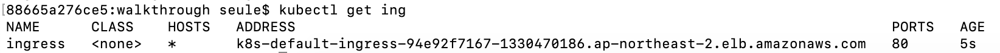

You can also find the same info from AWS Console. It can be found under [EC2 > Load Balancers](https://ap-northeast-2.console.aws.amazon.com/ec2/v2/home?#LoadBalancers). Navigate to the Load Balancer page in the Amazon EC2 console then select the load balancer. The URL will be available as “DNS name” in the “Description” tab.

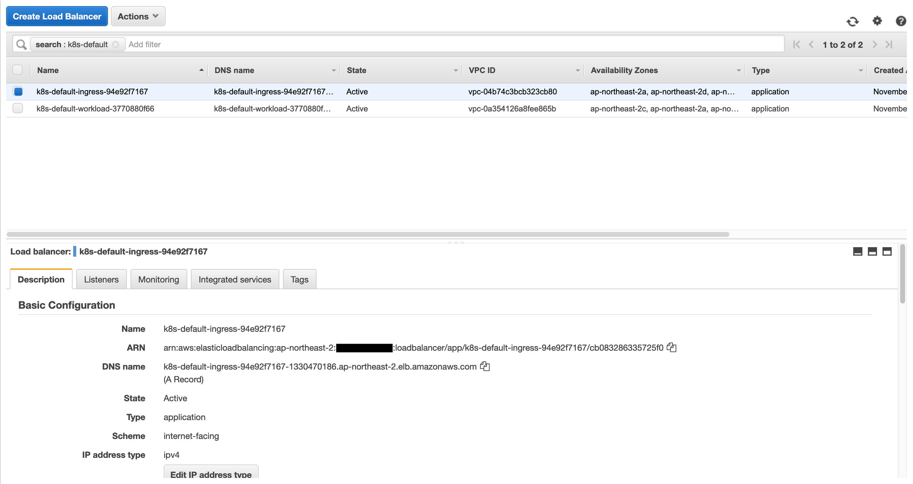

<br>

Open the URL from a browser:

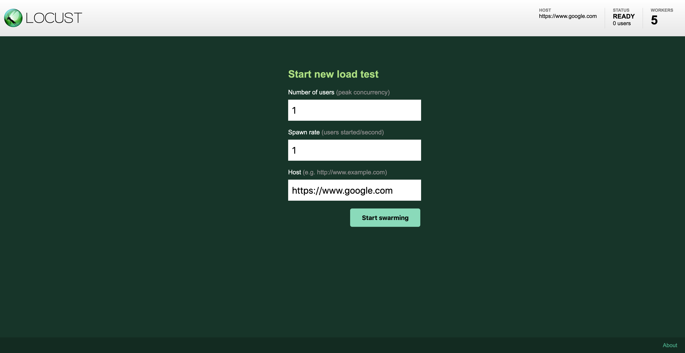

Alternatively, you can port-forward the Locust service to your local port to access the Locust dashboard without creating the Ingress resource. Open your browser and connect to <http://localhost:8089> with using below command.

```bash
# Port forwarding from local to locust-service resource
kubectl port-forward svc/locust 8089:8089
```

### STEP 4. Run Test

Enter the URL of your application that you deployed. Let’s enter `100` for the number of users and `1` for the spawn rate. Put [the endpoint URL of the workload cluster which was created before](./groundwork/install-sample-app#check-the-api-responses).

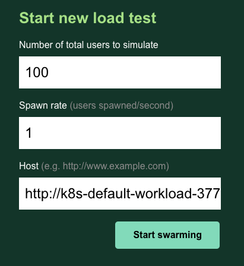

<br>

Let it run for few minutes and in the meantime, switch between the `Statistics` tab and the `Charts` tab to see how the test is unfolding.

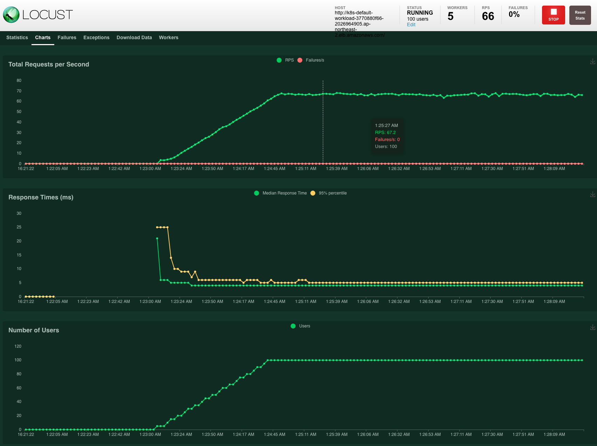

<br>

In the statistics tab, Locust briefly summarizes our loads testing result. It is important not to have any noticeable spikes in failure counts, which is depicted as the red line in the top chart.

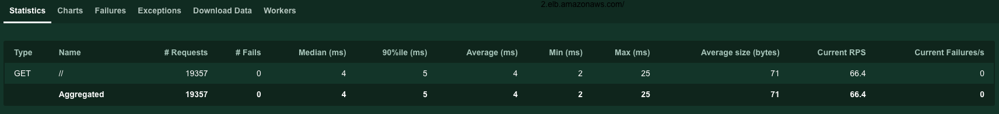

<br>

We can watch the CloudWatch Container Insights dashboard to get a glimpse of the basic metrics of the workload cluster. We can further experiment with the visualization of various metrics, including the EKS control plane, by setting up the Prometheus/Grafana dashboard. For advice on how to monitor the EKS Kubernetes Control Plane performance please refer to the [EKS Best Practices Guides](https://aws.github.io/aws-eks-best-practices/reliability/docs/controlplane/).

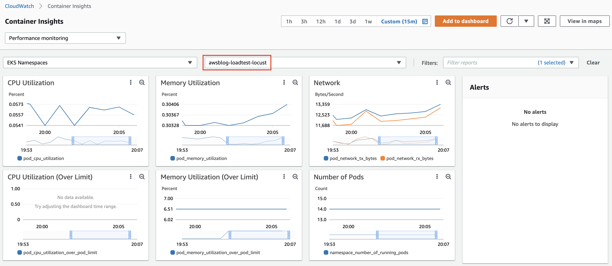

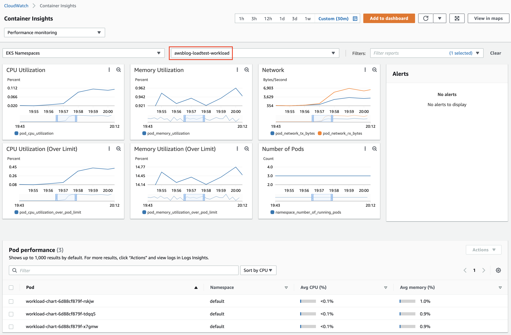

The test shows that the target workload running on EKS can handle requests from 100 users within a reasonable response time. You can take an up-close look at the performance metrics of the cluster from CloudWatch Container Insights.

Now we can give it a little more stress. Stop the test for now and put more users. Let’s put 1,000 users with spawn rate of 10 and compare it with the previous graph.

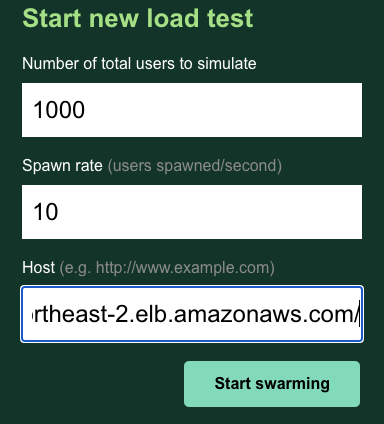

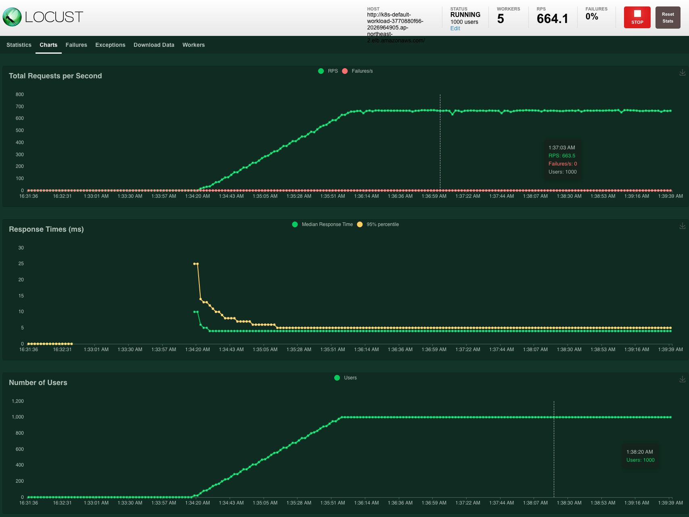

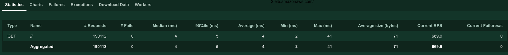

It looks similar to previous test. It seems that the service can cover these loads.

### STEP 5. Run Test (2nd)

Now it’s time for a million users and examine for a prolonged time. Let’s put `1,000,000` users with spawn rate of `100`. Both workloads cluster and the Locust cluster itself have enough resources to cover this traffic. It shows a steady upward sloping graph. Suppose we had smaller instances for our clusters, or we gave the load generator more CPU burden, then we will be able to see the Cluster Autoscaler kicking in to add more nodes and the graph would have reflected several sudden bumps.

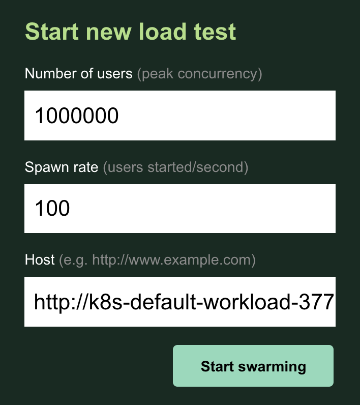

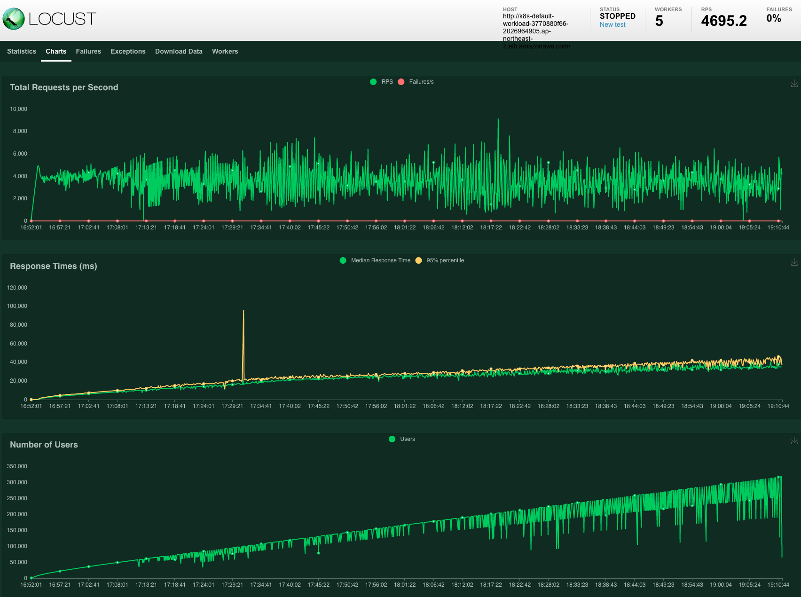

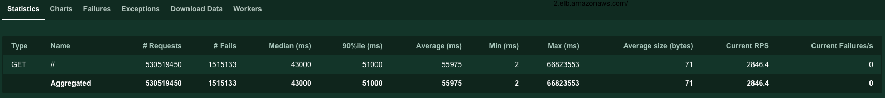

When our workload cluster needs to scale during the high peak of loads, we may see slower response time and even get 50X HTTP responses. Then we need some techniques for our clusters to be more responsive and fault-tolerant. Here are some tips that might be useful when you load test your own.

- Find the optimal pod’s readiness probes to minimize the time to wait for newly scaled pods.

- Fine-tune the HPA/CA configuration for the specific workloads in order for the Autoscaler to scale out within a tolerable time span.

- HPA reaction time + CA reaction time + node provisioning takes time, and node provisioning usually takes most of that time. Therefore it is useful to have a lighter AMI based on [Amazon EKS optimized Amazon Linux AMIs](<https://docs.aws.amazon.com/eks/latest/userguide/eks-optimized-ami.html>) and set resource limits for containers to ensure better bin-packing.

- Check with the scaling pod’s entire lifecycle to see if there is any bottleneck, such as a metric scraping delay, HPA trigger for pods to scale out, container image pulling, application loading time, readiness probe, and so on.

- Overprovisioning employs temporary pods with negative priority and takes ample space in the cluster. In the event of scaling action, it can dramatically reduce the node provisioning time because there already is a node ready to host scaling pods.

- Prevent Scale Down Eviction to the CA if you node scales down during the load testing. For more information about preventing scale down eviction, see [Cluster-Autoscaler - EKS Best Practices Guides](https://aws.github.io/aws-eks-best-practices/cluster-autoscaling/#prevent-scale-down-eviction).

- Understand the tradeoff between performance and cost. Run load tests on a regular basis to find and adjust the optimal spec of your cluster in terms of the number and type of nodes, ratio of spot instances, autoscaling threshold and algorithm etc.

- For more information about Autosacling on EKS, please read the [EKS Best Practice Guides](https://aws.github.io/aws-eks-best-practices/cluster-autoscaling/#optimizing-for-performance-and-scalability).

## Cleaning up

When you are done with your tests, clean up all the testing resources.

```bash
# Setting to clean up target EKS cluster: Workload / Locust

# Set optional environment variables
export AWS_PROFILE="YOUR_PROFILE" # If not, use 'default' profile
export AWS_REGION="YOUR_REGION"   # ex. ap-northeast-2

# Set common environment variables
export TARGET_GROUP_NAME="workload"
export TARGET_CLUSTER_NAME="awsblog-loadtest-${TARGET_GROUP_NAME}"

# Switch Context to executes commands on the target cluster: Workload / Locust
# Unset context
kubectl config unset current-context
# Set context of workload cluster
export TARGET_CONTEXT=$(kubectl config get-contexts | grep "${TARGET_CLUSTER_NAME}" | awk -F" " '{print $1}')
kubectl config use-context ${TARGET_CONTEXT}

# Check if current context set to run on workload cluster
kubectl config current-context
```

```bash
# Clean up target EKS cluster: Workload / Locust

# Uninstall All Helm Charts
helm list -A |grep -v NAME |awk -F" " '{print "helm -n "$2" uninstall "$1}' |xargs -I {} sh -c '{}'

# Check Empty Helm List
helm list -A

# Delete IRSA setting (must run before delete the cluster!)
eksctl delete iamserviceaccount --cluster "${TARGET_CLUSTER_NAME}" \
  --namespace "kube-system" --name "${CA:-cluster-autoscaler}"
eksctl delete iamserviceaccount --cluster "${TARGET_CLUSTER_NAME}" \
  --namespace "kube-system" --name "${AWS_LB_CNTL:-aws-load-balancer-controller}"

# Delete target EKS cluster: Workload / Locust
eksctl delete cluster --name="${TARGET_CLUSTER_NAME}"

# Delete ECR Repository: Workload only
aws ecr delete-repository --repository-name "${ECR_REPO_NAME:-sample-application}"
```

It’s done. One thing to note, the script above will only take down the `awsblog-loadtest-locust cluster`. Please make sure that you set TARGET_GROUP_NAME to `workload` and repeat the process again to take down the `awsblog-loadtest-workload cluster` as well.

## Summary

In this blog, we set up two EKS clusters and tools for load testing a workload running on EKS. With the Cluster Autoscaler in action, we could clearly observe that high loads generated by Locust were handled smoothly, as expected. Locust dashboard and CloudWatch Container Insights are useful to identify the maximum loads our cluster can withstand.

We can experiment further by customizing `locustfile.py` script with various testing scenarios reflecting real-world use cases. In our next blog post, we will introduce various techniques to make our EKS cluster better handle high, spiky loads of traffic during load testing.

TAGS: [EKS](https://aws.amazon.com/blogs/containers/tag/eks/), [Loadtest](https://aws.amazon.com/blogs/devops/tag/load-test/), [Locust](https://aws.amazon.com/blogs/devops/tag/locust/)

## Security

See [CONTRIBUTING](CONTRIBUTING.md#security-issue-notifications) for more information.

## License

This library is licensed under the MIT-0 License. See the LICENSE file.
