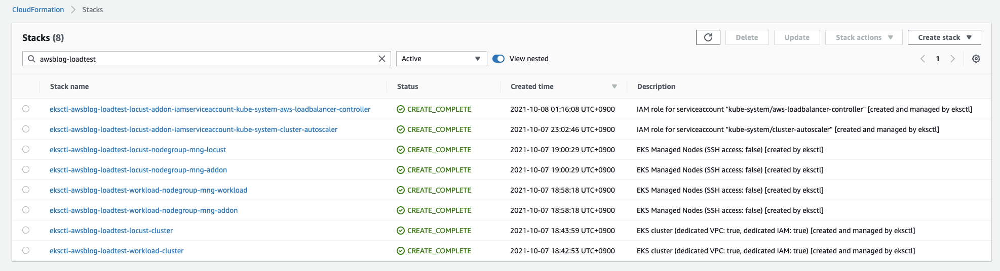
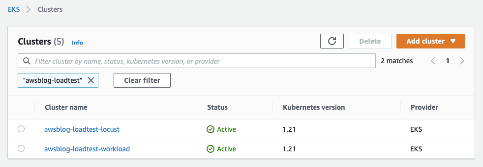

# Prepare EKS clusters

- [Prerequisite](#prerequisite)
- Provisioning EKS clusters
  - [Create Locust Cluster](#create-locust-cluster)
  - [Create Workload Cluster](#create-workload-cluster) (option)
  - [Result](#result)

## Prerequisite

- [kubectl](https://kubernetes.io/docs/tasks/tools/#kubectl) (check [version release](https://kubernetes.io/releases/))
- [eksctl](https://eksctl.io/introduction/#installation) (check [version release](https://github.com/weaveworks/eksctl/releases))
- [jq](https://stedolan.github.io/jq/download/)
- [awscli v2](https://docs.aws.amazon.com/cli/latest/userguide/getting-started-version.html)
- [Setting AWS Profile](https://docs.aws.amazon.com/cli/latest/userguide/cli-configure-profiles.html) (with [minimum IAM policies](https://eksctl.io/usage/minimum-iam-policies/))

  ```bash
  # Check your profile
  aws sts get-caller-identity
  ```

- Pull this repository

  ```bash
  git clone https://github.com/aws-samples/load-testing-eks-cluster-with-locust
  ```

## Create Locust cluster

### 1. Settings

```bash
# Set optional environment variables
export AWS_PROFILE="YOUR_PROFILE" # If not, use 'default' profile
export AWS_REGION="YOUR_REGION"   # ex. ap-northeast-2

# Set common environment variables
export TARGET_GROUP_NAME="locust"
export TARGET_CLUSTER_NAME="awsblog-loadtest-${TARGET_GROUP_NAME}"
export TARGET_REGION="${AWS_REGION}"

# Set specific environment variables
export TARGET_EKS_VERSION="1.21"

# Check
cat <<EOF
_______________________________________________
* AWS_PROFILE : ${AWS_PROFILE:-(default)}
* AWS_REGION  : ${AWS_REGION:-(invalid!)}
_______________________________________________
* TARGET_GROUP_NAME   : ${TARGET_GROUP_NAME}
* TARGET_CLUSTER_NAME : ${TARGET_CLUSTER_NAME}
* TARGET_REGION       : ${TARGET_REGION:-(invalid!)}
* TARGET_EKS_VERSION  : ${TARGET_EKS_VERSION}
EOF
```

> _**Notice**_  
> _If you use the variable (`TARGET_EKS_VERSION`) about the Kubernetes version,_  
> _maybe you need to check the version of `kubectl` and `eksctl`._  
> _We recommand to update the latest for matching those versions._

### 2. Create EKS cluster Configuration file

```bash
# Move to 'eks-clusters' directory from root of repository
cd groundwork/eks-clusters

# Create ClusterConfig file
cat eks-cluster-template.yaml | envsubst > "${TARGET_CLUSTER_NAME}.yaml"
```

### 3. Provision Locust cluster with eksctl

```bash
# Create EKS cluster
eksctl create cluster --with-oidc -f "${TARGET_CLUSTER_NAME}.yaml"
```

> _**Notice.**_  
> _This step takes about 20 minutes._  
> _Because it include that create all things (from VPC to EKS cluster)._

### 4. Check the provision with connection

```bash
# Create kubeconfig for your kubectl
eksctl utils write-kubeconfig \
  --cluster "${TARGET_CLUSTER_NAME}" \
  --region "${TARGET_REGION}" \
  --profile "${AWS_PROFILE:-(default)}"
```

```bash
# Check kubeconfig context
kubectl config current-context

# Like this..
# <IAM_ROLE>@<TARGET_CLUSTER_NAME>.<TARGET_REGION>.eksctl.io
```

```bash
# Check current nodes
kubectl get nodes -L position --sort-by=.metadata.labels.position

# Like this..
# NAME                                                 STATUS   ROLES    AGE     VERSION                POSITION
# ip-xxx-xxx-xxx-xxx.TARGET_REGION.compute.internal    Ready    <none>   46s     MATCH_ON_EKS_VERSION   addon
# ip-xxx-xxx-xxx-xxx.TARGET_REGION.compute.internal    Ready    <none>   48s     MATCH_ON_EKS_VERSION   locust
# ip-xxx-xxx-xxx-xxx.TARGET_REGION.compute.internal    Ready    <none>   52s     MATCH_ON_EKS_VERSION   locust
# ip-xxx-xxx-xxx-xxx.TARGET_REGION.compute.internal    Ready    <none>   44s     MATCH_ON_EKS_VERSION   locust
```

### 5. Set IdP federation for OIDC provider associated with cluster

```bash
eksctl utils associate-iam-oidc-provider --cluster=${TARGET_CLUSTER_NAME} --approve
```

- Refer. [How to find the federated OIDC Provider?](https://docs.aws.amazon.com/ko_kr/eks/latest/userguide/enable-iam-roles-for-service-accounts.html)

#### (option) Add identity to auth ConfigMap on other IAM user

```bash
# Set target ARN
export IAM_USER_ARN="USER_OR_ROLE_ARN" # e.g arn:aws:iam::111122223333:user/USER_NAME_A
export MAP_USERNAME="admin-$(echo ${IAM_USER_ARN} | awk -F"/" '{print $2}')"

# Check
cat <<EOF
_______________________________________________________
* TARGET_CLUSTER_NAME : ${TARGET_CLUSTER_NAME}
* IAM_USER_ARN : ${IAM_USER_ARN}
* MAP_USERNAME : ${MAP_USERNAME}
EOF
```

```bash
# Add identity target AWS IAM ARN to EKS Auth ConfigMap
eksctl create iamidentitymapping \
    --cluster ${TARGET_CLUSTER_NAME} \
    --group system:masters \
    --arn ${IAM_USER_ARN} \
    --username ${MAP_USERNAME}
```

```bash
# Check
kubectl -n kube-system get cm/aws-auth -o json | jq ".data.mapUsers" | jq -r

# Like this..
# - groups:
#   - system:masters
#   userarn: arn:aws:iam::111122223333:user/USER_NAME_A
#   username: admin-USER_NAME_A
# ...
```

---

## Create workload cluster

This is optional step when you need workload cluster for load testing.

```bash
# Set environment variables
export TARGET_GROUP_NAME="workload"
export TARGET_CLUSTER_NAME="awsblog-loadtest-${TARGET_GROUP_NAME}"
export TARGET_REGION="ap-northeast-2"
export TARGET_EKS_VERSION="1.21"
```

Then follow up [(pervious contents from step.2)](#2-create-eks-cluster-configuration-file)

---

## Results

- [AWS Console :: CloudFormation Stacks](https://console.aws.amazon.com/cloudformation/home#/stacks?filteringStatus=active&filteringText=awsblog-loadtest&viewNested=true&hideStacks=false)

  

- [AWS Console :: EKS clusters](https://console.aws.amazon.com/eks/home)

  
