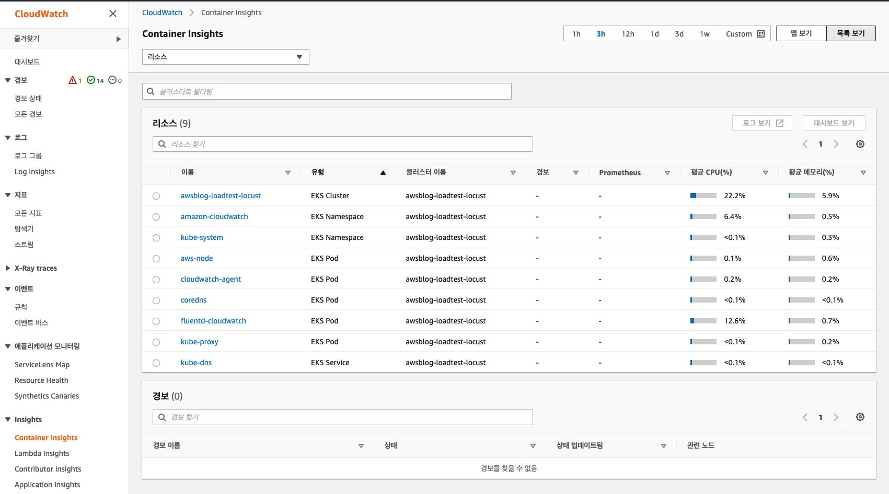

# Install basic addon charts

For load-tesing on eks, we basically need to install these kubernetes addons charts.
These charts are commonly used in eks clusters, thus we need to do the below installation jobs in both of clusters:
`awsblog-loadtest-locust` and `awsblog-loadtest-workload` (or your other target cluster).

Here is the list.

- [Metrics server](#deploy-metrics-server-yaml)
- [HPA (Horizontal Pod Autoscaler)](#skip-installation-step-for-hpa)
- [CA (Cluster Autoscaler)](#install-ca-helm-chart)
- [AWS Load Balancer Controller](#install-aws-load-balancer-controller-helm-chart)
- [Container Insights](#install-container-insights)

## Environment Settings

```bash
# Set optional environment variables
export AWS_PROFILE="YOUR_PROFILE" # If not, use 'default' profile
export AWS_REGION="YOUR_REGION"   # ex. ap-northeast-2
export ACCOUNT_ID=$(aws sts get-caller-identity --output json | jq ".Account" | tr -d '"')

# Set common environment variables
export TARGET_GROUP_NAME="locust" # Maybe use 'workload' at here, cause of the end of this document
export TARGET_CLUSTER_NAME="awsblog-loadtest-${TARGET_GROUP_NAME}"
export TARGET_REGION="${AWS_REGION}"

# Check
cat <<EOF
_______________________________________________
* AWS_PROFILE : ${AWS_PROFILE:-(default)}
* AWS_REGION  : ${AWS_REGION:-(invalid!)}
* ACCOUNT_ID  : ${ACCOUNT_ID:-(invalid!)}
_______________________________________________
* TARGET_GROUP_NAME   : ${TARGET_GROUP_NAME}
* TARGET_CLUSTER_NAME : ${TARGET_CLUSTER_NAME}
* TARGET_REGION       : ${TARGET_REGION:-(invalid!)}
EOF
```

📌 **Check your profile for `eksctl`**

```bash
# Check eksctl find out the cluster
eksctl get clusters --region "${TARGET_REGION}" | egrep "NAME|${TARGET_CLUSTER_NAME}"
```

📌 **Check your cluster context for `kubectl`**

```bash
# Unset context - Optional
kubectl config unset current-context

# Set cluster Context: 1. Locust / 2. Workload
export TARGET_CLUSTER_NAME=$(kubectl config get-contexts | sed 's/\*/ /g' | grep "@${TARGET_CLUSTER_NAME}." | awk -F" " '{print $1}')
kubectl config use-context ${TARGET_CLUSTER_NAME}

# Check
kubectl config current-context

# Like this..
# <IAM_ROLE>@<TARGET_CLUSTER_NAME>.<TARGET_REGION>.eksctl.io
```

---

## Deploy Metrics server (YAML)

```bash
kubectl apply -f https://github.com/kubernetes-sigs/metrics-server/releases/latest/download/components.yaml
```

- Check Deployment

  ```bash
  kubectl -n kube-system get deployment metrics-server
  ```

  ```plaintext
  NAME             READY   UP-TO-DATE   AVAILABLE   AGE
  metrics-server   1/1     1            1           40m
  ```

- Check APIService status

  ```bash
  kubectl get apiservice v1beta1.metrics.k8s.io -o json | jq '.status'
  ```

  ```json
  {
    "conditions": [
      {
        "lastTransitionTime": "2021-10-07T03:38:08Z",
        "message": "all checks passed",
        "reason": "Passed",
        "status": "True",
        "type": "Available"
      }
    ]
  }
  ```

<details>
<summary>📝 More read</summary>

- [EKS User Guide - Metrics Server](https://docs.aws.amazon.com/eks/latest/userguide/metrics-server.html)
- [EKS Web Application Workshop - Apply HPA](https://aws-eks-web-application.workshop.aws/en/100-scaling/100-pod-scaling.html)
- Kubernetes GitHub
  - [Metrics Server](https://github.com/kubernetes-sigs/metrics-server#kubernetes-metrics-server)

</details>

## Skip installation step for HPA

> The Horizontal Pod Autoscaler is a standard API resource in Kubernetes that simply requires that a metrics source
> (such as the Kubernetes metrics server) is installed on your Amazon EKS cluster to work.
> **You do not need to deploy or install the Horizontal Pod Autoscaler on your cluster to begin scaling your applications.**
> For more information, see [Horizontal Pod Autoscaler in the Kubernetes documentation](https://kubernetes.io/docs/tasks/run-application/horizontal-pod-autoscale/).

- Read more: [Amazon EKS User Guide - Horizontal Pod Autoscaler](https://docs.aws.amazon.com/eks/latest/userguide/horizontal-pod-autoscaler.html)

```bash
# Check existed Service Account for HPA
kubectl -n kube-system get sa horizontal-pod-autoscaler
```

---

## Install CA (Helm chart)

```bash
# Additional Environments
export CA_POLICY_JSON="cluster_autoscaler_autoDiscovery.json"
export CA_POLICY_NAME="ClusterAutoscaler-autoDiscovery"
export CA="cluster-autoscaler"
```

### 1. IRSA for cluster Autoscaler

#### 1-A. Create IAM policy

```bash
# Prepare policy json file
cat <<EOF > ${CA_POLICY_JSON} && jq "." ${CA_POLICY_JSON}
{
  "Version": "2012-10-17",
  "Statement": [
    {
      "Effect": "Allow",
      "Action": [
        "autoscaling:DescribeAutoScalingGroups",
        "autoscaling:DescribeAutoScalingInstances",
        "autoscaling:DescribeLaunchConfigurations",
        "autoscaling:DescribeTags",
        "autoscaling:SetDesiredCapacity",
        "autoscaling:TerminateInstanceInAutoScalingGroup"
      ],
      "Resource": "*"
    },
    {
      "Effect": "Allow",
      "Action": "ec2:Describe*",
      "Resource": "*"
    },
    {
      "Effect": "Deny",
      "Action": [
        "ec2:CreateTags",
        "ec2:DeleteTags"
      ],
      "Resource": "*"
    }
  ]
}
EOF

# Create IAM policy with the json file
aws iam create-policy \
    --policy-document "file://${CA_POLICY_JSON}" \
    --policy-name "${CA_POLICY_NAME}" \
    --output json | jq
```

>_**Notice**_
>
> If you provision the cluters(locust and workloads) in same account, maybe you already created this policy.
> If you do, you can skip this 1-A step and go to next step to set IRSA.

#### 1-B. Create Service Account with IRSA

```bash
# Set IRSA from IAM policy
eksctl create iamserviceaccount \
    --cluster "${TARGET_CLUSTER_NAME}" \
    --namespace kube-system \
    --name "${CA}" \
    --role-name "${TARGET_CLUSTER_NAME}-${CA}" \
    --attach-policy-arn "arn:aws:iam::${ACCOUNT_ID}:policy/${CA_POLICY_NAME}" \
    --override-existing-serviceaccounts \
    --approve

# Add labels on the service account
kubectl -n kube-system label sa "${CA}" \
    'k8s-addon'='cluster-autoscaler.addons.k8s.io' \
    'k8s-app'='cluster-autoscaler' \
    --overwrite
```

- Check the IRSA setting

  ```bash
  eksctl get iamserviceaccount --cluster "${TARGET_CLUSTER_NAME}" --name "${CA}"
  ```

  ```plaintext
  NAMESPACE    NAME                ROLE ARN
  kube-system  cluster-autoscaler  arn:aws:iam::XXXXOOOOXXXX:role/eksctl-awsblog-loadtest-locust-addon-iamserv-RoleX-XXXXXXXXXXX
  ```

- Check the Service Account

  ```bash
  kubectl -n kube-system get sa "${CA}"
  ```

  ```plaintext
  NAME                 SECRETS   AGE
  cluster-autoscaler   1         43s
  ```

- Check Labels of the Service Account

  ```bash
  kubectl -n kube-system get sa "${CA}" -o json | jq ".metadata.labels"
  ```

  ```json
  {
    "app.kubernetes.io/managed-by": "eksctl",
    "k8s-addon": "cluster-autoscaler.addons.k8s.io",
    "k8s-app": "cluster-autoscaler"
  }
  ```

  ```bash
  kubectl -n kube-system get sa "${CA}" -o json | jq ".metadata.annotations"
  ```

  ```json
  {
    "eks.amazonaws.com/role-arn": "arn:aws:iam::XXXXOOOOXXXX:role/eksctl-awsblog-loadtest-locust-addon-iamserv-RoleX-XXXXXXXXXXX"
  }
  ```

### 2. Install CA chart

```bash
# Helm chart repo setting
helm repo add autoscaler "https://kubernetes.github.io/autoscaler"
helm repo update autoscaler

# Prepare values file
export CA_VALUES_YAML="values.${TARGET_CLUSTER_NAME}.${CA}.yaml"
cat <<EOF > ${CA_VALUES_YAML} && cat ${CA_VALUES_YAML}
# Default values for '${CA}'
cloudProvider: "aws"
awsRegion: "${TARGET_REGION}"

# Scope all Auto Scaling group in cluster
autoDiscovery:
  clusterName: "${TARGET_CLUSTER_NAME}"

# IRSA
rbac:
  serviceAccount:
    create: false
    name: "${CA}"
    eks.amazonaws.com/role-arn: $(kubectl -n kube-system get sa "${CA}" -o json | jq '.metadata.annotations."eks.amazonaws.com/role-arn"')

# Deploy at Node matching Labels for '${CA}'
nodeSelector:
  position: "addon"

tolerations: []
EOF

# Helm chart installation
helm upgrade --install "addon-${CA}" autoscaler/cluster-autoscaler \
    -n kube-system -f "${CA_VALUES_YAML}"
```

- Check installation

  ```bash
  helm -n kube-system list -l name="addon-${CA}"
  ```

  ```bash
  kubectl -n kube-system get pods \
    -L "app.kubernetes.io/name" \
    -L "app.kubernetes.io/instance" \
    -l "app.kubernetes.io/name=aws-${CA},app.kubernetes.io/instance=addon-${CA}"
  ```

<details>
<summary>📝 More read</summary>

- [EKS Web App Workshop - Apply cluster Autoscaler](https://aws-eks-web-application.workshop.aws/en/100-scaling/200-cluster-scaling.html)
- Kubernetes GitHub
  - [Cluster Autoscaler on AWS](https://github.com/kubernetes/autoscaler/blob/master/cluster-autoscaler/cloudprovider/aws/README.md#cluster-autoscaler-on-aws)
  - [cluster-autoscaler chart](https://github.com/kubernetes/autoscaler/tree/master/charts/cluster-autoscaler#cluster-autoscaler)
    - [values](https://github.com/kubernetes/autoscaler/tree/master/charts/cluster-autoscaler#values)
    - [Scope all Auto Scaling Group in cluster](https://github.com/kubernetes/autoscaler/tree/master/charts/cluster-autoscaler#aws---using-auto-discovery-of-tagged-instance-groups)
- [EKS User Guide - cluster Autoscaler](https://docs.aws.amazon.com/eks/latest/userguide/cluster-autoscaler.html)

</details>

---

## Install AWS Load Balancer Controller (Helm chart)

```bash
# Additional Environments
export AWS_LB_CNTL_VERSION="v2.2.4"
export AWS_LB_CNTL_POLICY_JSON="aws_load_balancer_controller-$(echo ${AWS_LB_CNTL_VERSION} | sed 's/\./_/g').json"
export AWS_LB_CNTL_POLICY_NAME="AwsLoadBalancerController-$(echo ${AWS_LB_CNTL_VERSION} | sed 's/\./_/g')"
export AWS_LB_CNTL="aws-load-balancer-controller"
```

🛎️ If you want to use another version, [click to check the release](https://github.com/kubernetes-sigs/aws-load-balancer-controller/releases).

### 1. IRSA for AWS Load Balancer Controller

- Create IAM policy

  ```bash
  # Download the iam policy json file
  curl "https://raw.githubusercontent.com/kubernetes-sigs/aws-load-balancer-controller/${AWS_LB_CNTL_VERSION}/docs/install/iam_policy.json" \
      -o "${AWS_LB_CNTL_POLICY_JSON}"

  # Create IAM policy with the json file
  aws iam create-policy \
      --policy-document "file://${AWS_LB_CNTL_POLICY_JSON}" \
      --policy-name "${AWS_LB_CNTL_POLICY_NAME}" \
      --output json | jq
  ```

  🛎️ If you meet an error in this step, [follow up this issue (in AWS Console)](https://github.com/kubernetes-sigs/aws-load-balancer-controller/issues/2276#issuecomment-937925833).

  >_**Notice**_
  >
  > If you provision the cluters(locust and workloads) in same account, maybe you already created this policy.
  > If you do, you can skip this 1-A step and go to next step to set IRSA.

- Set IRSA from IAM policy

  ```bash
  eksctl create iamserviceaccount \
      --cluster "${TARGET_CLUSTER_NAME}" \
      --namespace kube-system \
      --name "${AWS_LB_CNTL}" \
      --role-name "${TARGET_CLUSTER_NAME}-${AWS_LB_CNTL}" \
      --attach-policy-arn "arn:aws:iam::${ACCOUNT_ID}:policy/${AWS_LB_CNTL_POLICY_NAME}" \
      --override-existing-serviceaccounts \
      --approve

  # Add labels on the service account
  kubectl -n kube-system label sa "${AWS_LB_CNTL}" \
        'k8s-app'='aws-load-balancer-controller' \
        --overwrite
  ```

- Check the IRSA setting

  ```bash
  eksctl get iamserviceaccount \
      --cluster "${TARGET_CLUSTER_NAME}" \
      --name "${AWS_LB_CNTL}"
  ```

  ```plaintext
  NAMESPACE    NAME                         ROLE ARN
  kube-system  aws-loadbalancer-controller  arn:aws:iam::XXXXOOOOXXXX:role/eksctl-awsblog-loadtest-locust-addon-iamserv-RoleX-XXXXXXXXXXX
  ```

- Check the Service Account

  ```bash
  kubectl -n kube-system get sa "${AWS_LB_CNTL}"
  ```

  ```plaintext
  NAME                           SECRETS   AGE
  aws-load-balancer-controller   1         82s
  ```

  ```bash
  kubectl -n kube-system get sa "${AWS_LB_CNTL}" -o json | jq ".metadata.annotations"
  ```

  ```json
  {
    "eks.amazonaws.com/role-arn": "arn:aws:iam::XXXXOOOOXXXX:role/eksctl-awsblog-loadtest-locust-addon-iamserv-RoleX-XXXXXXXXXXX"
  }
  ```

### 2. Install AWS Load Balancer Controller chart

```bash
# Helm chart repo setting
helm repo add eks "https://aws.github.io/eks-charts"
helm repo update eks

# Install TargetGroupBinding CRDs
kubectl apply -k "github.com/aws/eks-charts/stable/aws-load-balancer-controller//crds?ref=master"
  # customresourcedefinition.apiextensions.k8s.io/ingressclassparams.elbv2.k8s.aws configured
  # customresourcedefinition.apiextensions.k8s.io/targetgroupbindings.elbv2.k8s.aws configured

# Get VPC ID of Target cluster
export VPC_ID=$(aws eks describe-cluster \
                --name ${TARGET_CLUSTER_NAME} \
                --query "cluster.resourcesVpcConfig.vpcId" \
                --output text)

# Prepare values file
export AWS_LB_CNTL_VALUES_YAML="values.${TARGET_CLUSTER_NAME}.${AWS_LB_CNTL}.yaml"
cat <<EOF > ${AWS_LB_CNTL_VALUES_YAML} && cat ${AWS_LB_CNTL_VALUES_YAML}
# Default values for '${AWS_LB_CNTL}'
clusterName: "${TARGET_CLUSTER_NAME}"
region: "${TARGET_REGION}"
vpcId: "${VPC_ID}"

# IRSA
serviceAccount:
  create: false
  name: "${AWS_LB_CNTL}"

# Deploy at Node matching Labels for '${AWS_LB_CNTL}'
nodeSelector:
  position: "addon"

tolerations: []
EOF

# Helm chart installation
helm upgrade --install "addon-${AWS_LB_CNTL}" eks/aws-load-balancer-controller \
    -n kube-system -f "${AWS_LB_CNTL_VALUES_YAML}"
```

- Check installation

  ```bash
  helm -n kube-system list -l name="addon-${AWS_LB_CNTL}"
  ```

  ```bash
  kubectl -n kube-system get pods \
    -L "app.kubernetes.io/name" \
    -L "app.kubernetes.io/instance" \
    -l "app.kubernetes.io/name=${AWS_LB_CNTL},app.kubernetes.io/instance=addon-${AWS_LB_CNTL}"
  ```

<details>
<summary>📝 More read</summary>

- [EKS Workshop - Setting up the LB Contorller](https://www.eksworkshop.com/beginner/180_fargate/prerequisites-for-alb/)
- [AWS Load Balancer Controller](https://kubernetes-sigs.github.io/aws-load-balancer-controller)
- Others
  - [EKS User Guide - AWS Load Balancer](https://docs.aws.amazon.com/ko_kr/eks/latest/userguide/aws-load-balancer-controller.html)
  - [EKS Web App Workshop - Create AWS Load Balancer Conctroller](https://aws-eks-web-application.workshop.aws/en/60-ingress-controller/100-launch-alb.html)

</details>

## Install Container Insights

### 1. Add the necessary policy to the IAM role for your worker nodes

```bash
# Set Node Role Name
export ADDON_NODEGROUP_ROLE_NAME=$(eksctl get nodegroup --cluster $TARGET_CLUSTER_NAME --name mng-addon --output json  | jq -r ".[0].NodeInstanceRoleARN" | cut -d '/' -f 2)
export TARGET_NODEGROUP_ROLE_NAME=$(eksctl get nodegroup --cluster $TARGET_CLUSTER_NAME --name mng-${TARGET_GROUP_NAME} --output json  | jq -r ".[0].NodeInstanceRoleARN" | cut -d '/' -f 2)

# Check
cat <<EOF
_______________________________________________
* ADDON_NODEGROUP_ROLE_NAME : ${ADDON_NODEGROUP_ROLE_NAME}
* TARGET_NODEGROUP_ROLE_NAME: ${TARGET_NODEGROUP_ROLE_NAME}
EOF

# Attach the policy
aws iam attach-role-policy \
  --role-name ${ADDON_NODEGROUP_ROLE_NAME} \
  --policy-arn arn:aws:iam::aws:policy/CloudWatchAgentServerPolicy
aws iam attach-role-policy \
  --role-name ${TARGET_NODEGROUP_ROLE_NAME} \
  --policy-arn arn:aws:iam::aws:policy/CloudWatchAgentServerPolicy

# Verify the policy has been attached.
aws iam list-attached-role-policies --role-name ${ADDON_NODEGROUP_ROLE_NAME} | grep CloudWatchAgentServerPolicy || echo 'Policy not found'
aws iam list-attached-role-policies --role-name ${TARGET_NODEGROUP_ROLE_NAME} | grep CloudWatchAgentServerPolicy || echo 'Policy not found'

# Like this..
"PolicyName": "CloudWatchAgentServerPolicy",
"PolicyArn": "arn:aws:iam::aws:policy/CloudWatchAgentServerPolicy"
```

### 2. Quick Start setup for Container Insights on Amazon EKS and Kubernetes

```bash
# Quick Start with the CloudWatch agent and Fluentd
curl https://raw.githubusercontent.com/aws-samples/amazon-cloudwatch-container-insights/latest/k8s-deployment-manifest-templates/deployment-mode/daemonset/container-insights-monitoring/quickstart/cwagent-fluentd-quickstart.yaml | sed "s/{{cluster_name}}/${TARGET_CLUSTER_NAME}/;s/{{region_name}}/${TARGET_REGION}/" | kubectl apply -f -
```

- Check installation

  ```bash
  kubectl get all -n amazon-cloudwatch
  ```

### 3. Result

- [AWS Console :: Container Insights](https://console.aws.amazon.com/cloudwatch/home?region=ap-northeast-2#container-insights:infrastructure)
  

<details>
<summary>📝 More read</summary>

- [EKS Workshop - EKS CloudWatch Container Insights](https://www.eksworkshop.com/intermediate/250_cloudwatch_container_insights/)
- [Amazon Cloudwach Container Insights](https://github.com/aws-samples/amazon-cloudwatch-container-insights)
- Others
  - [EKS User Guide - Using Container Insights](https://docs.aws.amazon.com/AmazonCloudWatch/latest/monitoring/ContainerInsights.html)

</details>

---

📌 **It's done!**

Locust cluster settings has been done.

```bash
# To avoid conflictions, free the environment variables
unset TARGET_GROUP_NAME
unset TARGET_CLUSTER_NAME
```

**The Workload cluster also needs these same setting.**
So, you need to walk through with below commands at [top of steps](#environment-settings) for **Workload cluster.**

```bash
# Environments
export TARGET_GROUP_NAME="workload"
export TARGET_CLUSTER_NAME="awsblog-loadtest-${TARGET_GROUP_NAME}"

# Check
cat <<EOF
---
* TARGET_GROUP_NAME: ${TARGET_GROUP_NAME}
* TARGET_CLUSTER_NAME: ${TARGET_CLUSTER_NAME}
EOF
```
