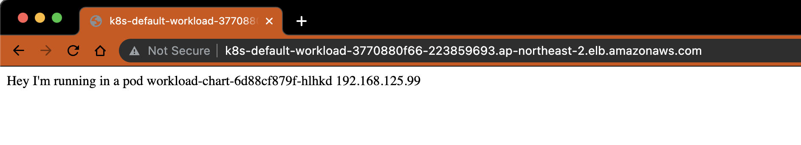
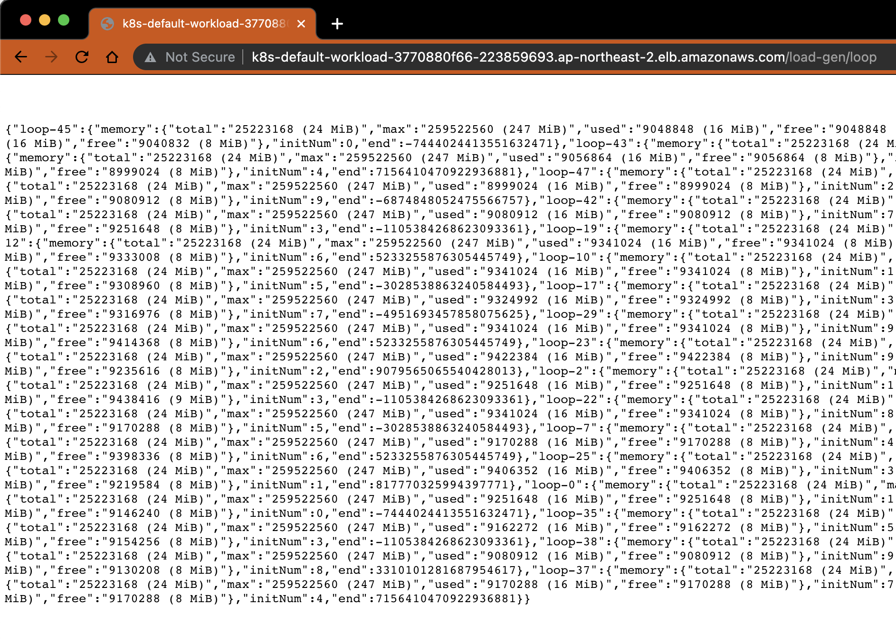

# Install Sample Application

As the last ground work, we need to deploy app chart for workload for target of load-testing.
(If you already have workload to follow our journey, you can use yours.)

- [Install Sample Application](#install-sample-application)
  - [Prepare](#prepare)
    - [Prerequisites](#prerequisites)
    - [Set environment](#set-environment)
    - [Create an ECR repository](#create-an-ecr-repository)
    - [Pull a public container image](#pull-a-public-container-image)
      - [(Option) Test this container image](#option-test-this-container-image)
    - [Tag this image](#tag-this-image)
    - [Push the image tag](#push-the-image-tag)
  - [Install Workload application (Helm chart)](#install-workload-application-helm-chart)
    - [Set context of kubectl](#set-context-of-kubectl)
    - [Prepare `values.yaml` file](#prepare-valuesyaml-file)
    - [Install workload chart](#install-workload-chart)
    - [Check the API responses](#check-the-api-responses)
  - [Tip. Clean up the workloads](#tip-clean-up-the-workloads)

## Prepare

### Prerequisites

- Docker
  - In Mac or Windows
    - [docker-desktop](https://www.docker.com/products/docker-desktop): easy to setup
    - docker-engine using [minikube](https://minikube.sigs.k8s.io/docs/start/) with [`docker-env` setting](https://minikube.sigs.k8s.io/docs/commands/docker-env/)
      : way to use free in group or enterprise side
  - In Amazon Linux 2
    - [docker-engine](https://gist.github.com/npearce/6f3c7826c7499587f00957fee62f8ee9#file-install-docker-md)
- [yq](https://github.com/mikefarah/yq/#install)

### Set environment

```bash
# Set optional environment variables
export AWS_PROFILE="YOUR_PROFILE" # If not, use 'default' profile
export AWS_REGION="YOUR_REGION"   # ex. ap-northeast-2
export ACCOUNT_ID=$(aws sts get-caller-identity --output json | jq ".Account" | tr -d '"')

# Set specific environment variables
export ECR_URL="${ACCOUNT_ID}.dkr.ecr.${AWS_REGION}.amazonaws.com"
export ECR_REPO_NAME="sample-application"

# Check
cat <<EOF
_______________________________________________
* AWS_PROFILE   : ${AWS_PROFILE:-(default)}
* AWS_REGION    : ${AWS_REGION:-(invalid!)}
* ACCOUNT_ID    : ${ACCOUNT_ID:-(invalid!)}
_______________________________________________
* ECR_URL       : ${ECR_URL}
* ECR_REPO_NAME : ${ECR_REPO_NAME}
EOF
```

### Create an ECR repository

```bash
# Create repository using AWS CLI
aws ecr create-repository --repository-name ${ECR_REPO_NAME} --output json | jq

# Check
aws ecr describe-repositories --repository-name ${ECR_REPO_NAME} --output json | jq
```

> #### Why we use the ECR repository?
>
> In our load-testing journey, if the load increases, the EKS's MNG(Managed Nodegroup) will provision new worker nodes to allocate new pods.
> At that point, if you use directly the public DockerHub's image, then **you will be block to pull it from the DockerHub** on your NAT Gateway's EIP address the EKS cluster has used.
> The reason why that the DockerHub set the rate limits policy after November 20, 2020 (about anonymous and free authenticated use of DockerHub).
> To avoid this issue and smoothy journey, we create a private ECR repository to psuh and pull easyly.
>
> If you want to check more information about the DockerHub's rate limits, please click [this article](https://www.docker.com/increase-rate-limits) and [the DockerHub pricing board](https://www.docker.com/pricing).

### Pull a [public container image](https://hub.docker.com/r/dev2sponge/load-testing-spring-worker)

```bash
docker pull dev2sponge/load-testing-spring-worker:latest
```

#### (Option) Test this container image

```bash
# Test this image with running container
docker run --rm -d --name local-app -p 8080:8080 dev2sponge/load-testing-spring-worker:latest

# Get Logs of the container
docker logs -f local-app
```

Then access to 'http://localhost:8080' and 'http://localhost:8080/load-gen/loop?count=30&range=1000' on your browser. You can check two facts.

1. Browser's response
2. Container's system logs

```bash
# Stop the docker logs process
^C # type `control + c`

# Stop the container: this container will be deleted automatically because of the '-d' option.
docker stop local-app
```

### Tag this image

```bash
docker tag dev2sponge/load-testing-spring-worker:latest ${ECR_URL}/${ECR_REPO_NAME}:latest

# Check the new tag
docker image ls |grep "${ECR_URL}/${ECR_REPO_NAME}"
```

### Push the image tag

```bash
# Login to ECR
aws ecr get-login-password | docker login --username AWS --password-stdin ${ECR_URL}

# Push the image tag to the ECR repository
docker push ${ECR_URL}/${ECR_REPO_NAME}:latest

# Check the pushed image in the ECR repository
aws ecr list-images --repository-name ${ECR_REPO_NAME} --output json | jq -c '.imageIds |map(select(.imageTag == "latest"))'
```

## Install Workload application (Helm chart)

### Set context of kubectl

```bash
# Unset context
kubectl config unset current-context

# Set Workload Cluster Context
export WORKLOAD_CLUSTER_NAME="awsblog-loadtest-workload"
export WORKLOAD_CONTEXT=$(kubectl config get-contexts | sed 's/\*/ /g' | grep "@${WORKLOAD_CLUSTER_NAME}." | awk -F" " '{print $1}')
kubectl config use-context ${WORKLOAD_CONTEXT}

# Check
kubectl config current-context

# Like this..
# <IAM_ROLE>@awsblog-loadtest-workload.<TARGET_REGION>.eksctl.io
```

### Prepare `values.yaml` file

```bash
# Move to 'install-sample-app' directory from root of repository
cd groundwork/install-sample-app

# Create 'values.yaml' file from template
cat workload-chart/values.template | envsubst > workload-chart/values.yaml

# Check image tag
yq e '.image' -I2 workload-chart/values.yaml
```

### Install workload chart

```bash
# In 'install-sample-app' directory
export CHART_NAME="workload-chart"
helm package ${CHART_NAME}

# Install in default namespace
helm upgrade --install ${CHART_NAME} "${CHART_NAME}-0.1.0.tgz"

# Check
helm list | egrep "NAME |${CHART_NAME}"

# Get Pods
kubectl get pods -L "load-type=on-cpu"

# Describe Deployment: check 'Pod Template' and 'Events'
kubectl describe deployment ${CHART_NAME}

# Get Service
kubectl get service ${CHART_NAME}

# Get Ingress
kubectl get ingress ${CHART_NAME}

# Copy the Ingress Address to your clipboard
kubectl get ingress ${CHART_NAME} -o jsonpath='{.status.loadBalancer.ingress[0].hostname}' | pbcopy
```

### Check the API responses

Once you have the sample application installed successfully, you will be able to see a welcome message from the sample application by visiting the DNS name of the Application Load Balancer that is associated with the ingress created by the chart. You can check response message in your browser like below.

- `/`
  

- `/load-gen/loop?count=30&range=1000`
  

  > _**Notice**_
  >
  > After deploy the k8s resources with helm chart, the ALB will be provisioned by [AWS-LB-controller](../install-addon-chart#install-aws-load-balancer-controller-helm-chart).
  > Immediatly after that, the endpoint could be unavailable.
  > Because of ALB health-check mechanism, you need to wait for a while.
  > Commonly it could be check the response from 15 seconds to 2 minutes.

Nice! It's done :)

## Tip. Clean up the workloads

```bash
# Uninstall this chart existed in default namespace
helm delete ${CHART_NAME:-workload-chart}

# Delete ECR repository
aws ecr delete-repository --repository-name "${ECR_REPO_NAME:-sample-application}"
```

> The total cripts for all-clean-up can be found at ['Cleaning up' step.](../../#cleaning-up), end of contents.
